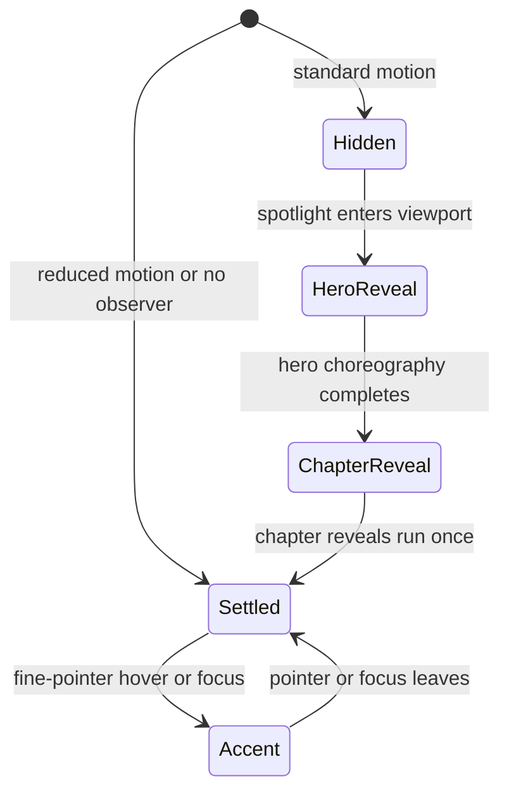
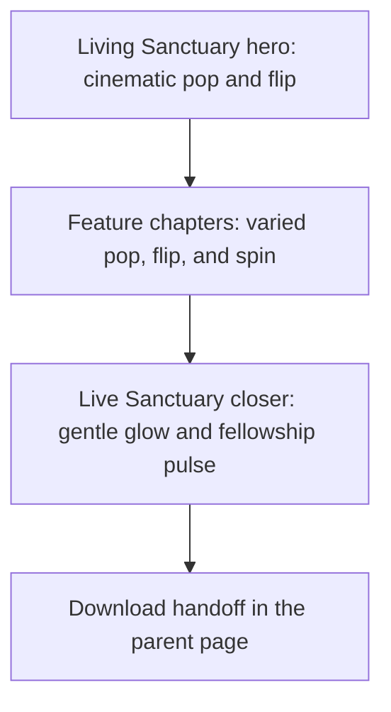

# Infinite Canvas Living Sanctuary Motion - Plan

## Goal Capsule

- **Objective:** Visitors experience Infinite Canvas as a joyful, memorable digital sanctuary while they can still understand its core study and fellowship capabilities at a glance.
- **Means:** Recompose the spotlight as a Living Sanctuary Board with layered one-time reveals, gentle ambient motion, and responsive static fallbacks (KTD1, KTD2, KTD4).
- **Authority:** The Product Contract owns visible behavior and scope. The Planning Contract owns the implementation mechanism. `CLAUDE.md` owns the brand, motion, mobile, and verification constraints.
- **Execution profile:** Standard, sequential UI work in the existing plain HTML, CSS, and vanilla JavaScript stack.
- **Stop conditions:** Stop before shipping if motion cannot honor reduced-motion preferences, if the iframe gains nested scrolling, or if the 375px layout clips or overflows.
- **Tail ownership:** Standalone `ce-work` owns implementation, local verification, review, and a local commit. It must not push without a separate user instruction.

---

## Product Contract

### Summary

Upgrade the homepage Infinite Canvas spotlight into a cinematic Living Sanctuary Board. The section will combine bold pop, flip, and spin reveals with slow halo drift so the experience feels exciting without losing the warmth and reverence of God's Sanctuary App.

### Problem Frame

The current spotlight explains Infinite Canvas with strong media and copy, but its presentation is mostly static. Eleven long cards span about 7,500px at desktop width, the hero video sits in a conventional frame, and the section has no coordinated entrance choreography or reduced-motion treatment. The result communicates feature breadth without delivering the playful, creative energy promised by an infinite visual workspace.

The landing page already establishes a warmer motion language elsewhere through scroll reveals, layered 3D stages, halo pulses, and slow floating elements. Infinite Canvas should become the clearest expression of that language because it leads the feature flow and represents the app's most open-ended creative tool.

### Key Decisions

- **Layer all three motion intensities.** (session-settled: user-directed — chosen over a single Sanctuary Spectacle, Full Kinetic, or Gentle Sanctuary mode: the user wants the hero, feature reveals, and ambient layer to express all three.) Governs R1, R2, R3, R4, R5.

### Requirements

**Visual story**

- R1. The spotlight opens with a Living Sanctuary Board composition that makes the existing study-map media feel embedded in an active infinite canvas rather than placed in a conventional video frame.
- R2. The hero provides the strongest spectacle through staged depth, a short pop or flip entrance, sacred artwork, and warm gold-thread or halo accents.
- R3. Feature media and copy reveal through a varied but coherent set of pop, flip, and spin entrances as visitors move through the section.
- R4. Settled elements use gentle sanctuary motion such as slow drift, breathing glows, and small rotational movement instead of constant high-intensity animation.
- R5. The redesign preserves every current Infinite Canvas capability and representation claim, including cultural stickers, sacred templates, gold-thread connections, landscapes, ready-made boards, lasso movement, and live collaboration.

**Brand and interaction**

- R6. The spotlight uses the locked parchment, brown, gold, terra, and sage palette with Hammersmith One and no cool neon treatment.
- R7. Decorative motion remains subordinate to readable text, muted media, and meaningful feature hierarchy.
- R8. The closing call to action takes visitors from the iframe to the parent landing page's download section instead of linking to a no-op fragment.

**Responsive access and performance**

- R9. At 375px, the spotlight becomes a single readable flow with no horizontal overflow, clipped media, overlapping copy, or dense decorative clutter.
- R10. A reduced-motion preference renders every element in its final visible state, removes entrance, hover, spin, drift, and pulse animation, and pauses autoplay video on a stable frame.
- R11. Motion uses transform and opacity where practical, avoids scroll-loop layout work, and pauses off-screen video through the existing observer pattern.
- R12. The embedded spotlight continues to auto-size to its content without nested scrolling or visible height jumps after motion settles.

### Success Criteria

- A visitor can identify Infinite Canvas, its creative purpose, and at least three major capabilities from the hero and first showcase chapter.
- The hero supplies a clear visual “wow” moment, while later motion remains varied and does not compete with reading.
- Desktop and 375px layouts preserve warm contrast and contain every visible element within the viewport.
- Reduced-motion mode is fully readable and visually complete rather than an empty pre-reveal state.
- The parent page and direct spotlight page load without console errors.

### Scope Boundaries

- Keep the redesign inside the Infinite Canvas spotlight and its homepage integration.
- Reuse the current Infinite Canvas videos, fonts, and sticker assets. Do not commission or generate new visual assets in this change.
- Preserve the current feature claims and the overall order of ideas. Recomposition may merge repetitive video-only cards into stronger visual chapters, but it must not remove a capability.
- Do not add a framework, animation package, bundler, or server-side dependency.
- Do not redesign the homepage hero, other feature spotlights, pricing, legal content, or the Infinite Canvas product itself.

#### Deferred to Follow-Up Work

- Measure visitor engagement with the Infinite Canvas call to action after an analytics strategy exists.
- Recut or replace the current product videos only if the final layout exposes media-quality limitations that CSS treatment cannot solve.

---

## Planning Contract

### Key Technical Decisions

- KTD1. **Recompose before animating.** Build a hero stage and a smaller set of visual chapters from the existing content so motion reinforces a clear story instead of decorating the current masonry unchanged.
- KTD2. **Use a three-layer motion grammar.** (session-settled: user-directed — chosen over applying one uniform motion intensity: the user selected a blend of cinematic, playful, and gentle treatments.) Use one cinematic hero reveal, one-time pop/flip/spin variants for chapters, and slow ambient movement after elements settle. Implements R1, R2, R3, R4, R7.
- KTD3. **Stay native to the site.** Use CSS keyframes, transitions, and one reveal `IntersectionObserver` alongside the existing video-visibility observer; do not add GSAP or another runtime dependency.
- KTD4. **Treat motion as progressive enhancement.** Reveal content immediately when `IntersectionObserver` is unavailable, disable CSS motion and autoplay video under `prefers-reduced-motion: reduce`, and remove hover tilt on coarse pointers and narrow layouts.
- KTD5. **Preserve iframe isolation.** Keep the spotlight in `mockups/canvas-spotlight.html`, bump the homepage iframe version, and target the parent document from the closing download link.
- KTD6. **Stabilize visual evidence at the spotlight boundary.** Test the direct spotlight page so existing animation-freeze helpers can control its CSS and video frames without reaching across the parent iframe.

### High-Level Technical Design

The motion lifecycle has one entrance and one settled state. Reduced-motion and unsupported-observer paths bypass choreography and expose the settled composition immediately.

The visual composition follows a restrained intensity curve:

### Implementation Constraints

- Keep human-authored source in the existing standalone HTML files.
- Use the brand easing `cubic-bezier(0.16, 1, 0.3, 1)` for short interactive motion and slower ease-in-out timing for ambient drift.
- Avoid bounce or spring motion even when the effect is named “pop.” Overshoot must be brief and controlled.
- Assign stable aspect ratios to video frames so metadata loading cannot move surrounding copy.
- Mark decorative layers as hidden from assistive technology and keep the textual reading order independent of visual positioning.

### Sequencing

First establish the static visual hierarchy. Add motion only after the final-state layout works at desktop and mobile widths. Integrate the parent handoff and performance behavior next. Finish with deterministic smoke and visual coverage.

### Risks and Mitigations

- **Motion overload:** Too many simultaneous effects would weaken the sanctuary tone. Limit spectacle to the hero and stagger later effects so only one local cluster commands attention.
- **Mobile compositing cost:** Multiple videos, blur filters, and 3D transforms can overwork mobile Safari. Reduce decorative layers and remove hover or deep perspective below the mobile breakpoint.
- **Invisible reduced-motion content:** Pre-reveal opacity can leave content hidden when animation is disabled. Set the final visible state directly inside the reduced-motion query and test it.
- **Iframe height drift:** Recomposition changes document height and video metadata can shift it after the parent measures. Use stable media geometry and keep the existing resize retries effective.
- **Visual-test volatility:** Videos and continuous motion can produce unstable screenshots. Navigate directly to the spotlight, freeze video at frame zero, and capture named static regions rather than one full-page image.

### Sources and Research

- `mockups/canvas-spotlight.html` is the current spotlight, media inventory, copy source, and video visibility observer.
- `mockups/mosaic-spotlight.html` provides the site's staggered reveal and reduced-motion pattern.
- `mockups/games-spotlight.html` provides the large 3D stage, responsive perspective removal, and halo treatment.
- `mockups/themes-spotlight.html` provides layered depth, floating ambient elements, and fine-grained reveal composition.
- `index.html` owns the iframe wrapper, auto-height integration, download destination, and existing sticker reward spin treatment.
- `tests/smoke.spec.js`, `tests/visual.spec.js`, and `tests/utils.js` define the current behavior, visual baseline, video-freeze, and no-nested-scroll verification patterns.

---

## Implementation Units

### U1. Recompose the Living Sanctuary Board

- **Goal:** Replace the static hero frame and long masonry rhythm with a clearer sanctuary-stage hero and grouped visual chapters while retaining all current claims and media.
- **Requirements:** R1, R2, R5, R6, R7, R9.
- **Dependencies:** None.
- **Files:** `mockups/canvas-spotlight.html`, `tests/visual.spec.js`, `tests/__screenshots__/visual.spec.js/`.
- **Approach:**
  1. Build a layered hero stage around the study-map video with a warm halo, canvas grid or thread treatment, and a small number of existing sacred sticker assets.
  2. Group the current feature cards into coherent chapters for connection, creativity, sacred templates, and freeform movement.
  3. Preserve semantic heading order, readable copy, and every current video or capability inside the new composition.
  4. Define the final static layout at desktop and 375px before adding entrance states.
- **Patterns to follow:** The 3D device composition in `mockups/games-spotlight.html`; the layered depth collage in `mockups/themes-spotlight.html`; the warm palette and copy in the current spotlight.
- **Test scenarios:**
  - Load the direct spotlight at desktop width and verify the hero, every capability chapter, Live Sanctuary closer, and closing call to action are visible in semantic order.
  - Load at 375px and verify the document has no horizontal overflow and all video frames, headings, and tags stay within the viewport.
  - Freeze media and motion, then compare the hero and representative chapter regions against intentional desktop and mobile visual baselines.
- **Verification:** The static composition is complete at both target widths, all current capability content remains present, and visual baselines show no clipping or contrast loss.

### U2. Add the layered motion choreography

- **Goal:** Apply the settled cinematic, playful, and gentle motion layers as one coordinated scroll experience.
- **Requirements:** R1, R2, R3, R4, R7, R10, R11; KTD2, KTD3, KTD4.
- **Dependencies:** U1.
- **Files:** `mockups/canvas-spotlight.html`, `tests/smoke.spec.js`.
- **Approach:**
  1. Introduce role-based motion variants for hero, chapters, and ambient decoration rather than assigning arbitrary animation per element.
  2. Use one reveal observer that adds final-state classes once and disconnects completed targets.
  3. Limit pop, flip, and spin to entrance choreography, then transition visible elements into slow drift or a static settled state.
  4. Gate hover or focus accents to fine pointers and remove every CSS or video motion source in reduced-motion mode.
  5. Reveal content immediately if the observer API is unavailable or the element is already visible at load.
- **Execution note:** Treat this as progressive-enhancement behavior. Add or strengthen smoke coverage for the reveal and reduced-motion contract before changing the motion runtime.
- **Patterns to follow:** The reveal observer in `mockups/mosaic-spotlight.html`; the 3D entrance timing in `mockups/games-spotlight.html`; the reduced-motion blocks across both files.
- **Test scenarios:**
  - With normal motion, bring the spotlight into view and verify hero and chapter elements reach their final revealed classes once.
  - Scroll a revealed chapter out of view and back in and verify entrance choreography does not restart.
  - Emulate reduced motion before navigation and verify all content is immediately visible with no active animation or transition duration and every autoplay video paused on a stable frame.
  - Remove `IntersectionObserver` before the spotlight script runs and verify the complete static composition remains visible.
  - At 375px with a coarse-pointer layout, verify hover-only tilt and dense decorative motion are absent.
- **Verification:** Every motion layer follows KTD2, the section never depends on animation to expose content, and no observer or animation error appears in the console.

### U3. Complete the homepage handoff and media integration

- **Goal:** Connect the upgraded spotlight cleanly to the parent landing page and preserve fast, stable iframe behavior.
- **Requirements:** R8, R11, R12.
- **Dependencies:** U1, U2.
- **Files:** `mockups/canvas-spotlight.html`, `index.html`, `tests/smoke.spec.js`.
- **Approach:**
  1. Point the closing call to action at the parent page's download section with an explicit parent browsing target.
  2. Bump the canvas iframe version so deployed browsers request the upgraded spotlight.
  3. Preserve the current in-view video play and off-screen pause behavior, and add stable media geometry where needed.
  4. Confirm motion transforms do not change document flow after the parent completes its iframe height measurements.
- **Patterns to follow:** The current `flow-iframe-wrap` sizing script in `index.html`; the existing App Store destination in the homepage footer; the current video observer in `mockups/canvas-spotlight.html`.
- **Test scenarios:**
  - Load the homepage and verify the Canvas iframe height matches its content height within the existing tolerance and exposes no nested scrollbar.
  - Activate the Canvas call to action and verify the top-level document reaches the download section instead of navigating inside the iframe.
  - Bring a showcase video into view and then out of view and verify the existing play and pause behavior remains intact.
  - Load both the homepage and direct spotlight page and verify no console errors occur.
- **Verification:** The parent handoff works, the iframe remains a single scroll surface, the revised asset loads through the versioned URL, and off-screen media does not continue playing.

### U4. Lock the experience with deterministic regression coverage

- **Goal:** Make the new spotlight safe to refine by covering its layout, motion-accessibility contract, and parent integration.
- **Requirements:** R9, R10, R11, R12.
- **Dependencies:** U1, U2, U3.
- **Files:** `tests/smoke.spec.js`, `tests/visual.spec.js`, `tests/utils.js`, `tests/__screenshots__/visual.spec.js/`.
- **Approach:**
  1. Keep behavior assertions in the smoke suite and intentional pixel changes in the local visual suite.
  2. Navigate directly to the spotlight for visual capture so the current animation and video stabilization helpers act inside its document.
  3. Capture stable hero and representative chapter regions for desktop and mobile projects rather than a volatile full-page image.
  4. Extend the shared helper only if the new decorative selectors still vary after the existing global freeze.
- **Execution note:** Update visual baselines only after the final design is accepted as intentional. A baseline update must not hide overflow, contrast, or reduced-motion failures.
- **Patterns to follow:** Existing iframe sizing assertions in `tests/smoke.spec.js`; section-level snapshots in `tests/visual.spec.js`; media freezing in `tests/utils.js`.
- **Test scenarios:**
  - Run the smoke suite and verify normal reveal, reduced motion, observer fallback, mobile overflow, call-to-action handoff, iframe sizing, and console behavior pass.
  - Run the visual suite before accepting new baselines and inspect every Canvas diff at desktop and mobile widths.
  - Regenerate the intentional Canvas baselines and rerun the visual suite to verify deterministic output.
  - Run the complete Playwright suite and verify no existing homepage, pricing, FAQ, or footer baseline regresses outside the Canvas section.
- **Verification:** New Canvas smoke and visual coverage passes repeatedly, existing tests remain green, and every changed baseline corresponds to an intentional Canvas region.

---

## Verification Contract

| Gate                          | Applies to | Done signal                                                                                                                               |
| ----------------------------- | ---------- | ----------------------------------------------------------------------------------------------------------------------------------------- |
| `npm run format`              | All units  | Prettier completes and only intended source formatting changes remain.                                                                    |
| `npm run test:smoke`          | U2, U3, U4 | Motion, accessibility, CTA, iframe sizing, mobile overflow, and console assertions pass.                                                  |
| `npm run test:visual`         | U1, U4     | Existing baselines pass or fail only on intentional Canvas regions before baseline acceptance.                                            |
| `npm run test:update`         | U1, U4     | Intentional Canvas desktop and mobile baselines are updated after visual inspection.                                                      |
| `npm run test`                | Plan-wide  | Smoke and visual suites pass together after accepted baseline updates.                                                                    |
| Desktop browser review        | Plan-wide  | The hero has a clear spectacle moment, chapter motion is staggered, copy stays readable, and the CTA reaches the parent download section. |
| 375px browser review          | Plan-wide  | The layout is single-column, motion density is reduced, and no visible content clips or overflows.                                        |
| Reduced-motion browser review | U2, U4     | All content is immediately visible and static, with no active transform, pulse, drift, flip, or spin animation.                           |
| Console inspection            | Plan-wide  | The homepage and direct spotlight report no JavaScript errors.                                                                            |

---

## Definition of Done

- R1 through R12 are implemented without changing unrelated landing-page sections.
- U1 is complete when the Living Sanctuary Board and chapter layout preserve all current content at desktop and 375px.
- U2 is complete when all three motion layers run once in the intended hierarchy and every fallback displays the settled state.
- U3 is complete when the parent download handoff, versioned iframe, height integration, and video visibility behavior work together.
- U4 is complete when Canvas-specific smoke and visual coverage passes at desktop and mobile widths.
- Warm contrast, semantic reading order, and muted autoplay media remain intact.
- Formatting, smoke, visual, and complete Playwright gates pass after intentional baselines are accepted.
- Browser review confirms no nested scrolling, horizontal overflow, clipped transforms, or console errors.
- Experimental selectors, abandoned motion variants, and unused decorative markup are removed from the final diff.
- The final local commit includes only work-owned source, tests, and intentional Canvas baselines. No push occurs without explicit user direction.
